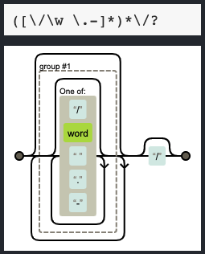
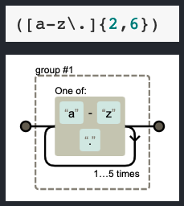
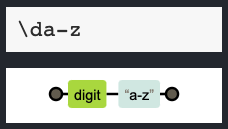
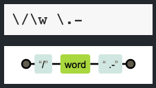
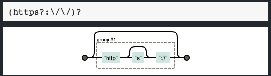
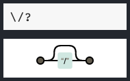
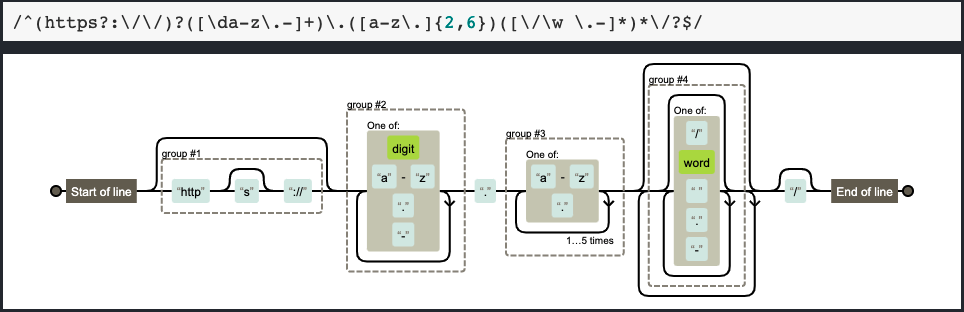

# Matching a URL with Regular Expressions (Regex) - Tutorial

Matching a URL is useful for different purposes whether to locate, detect or validate if the string contains a web address, targeting a page or other purposes.

This document will guide you in understanding the composition or pattern of the regular expression to match a URL.


## Summary

A regular expression provides a way to find the needed content in a set of string characters.

The regular expression to match a URL includes a combination of characters to locate the components of a URL, such as the `'http'` portion, if it includes the `'s'` for secured URL, any string of characters that are separated by a `'.'` dot, which will provide the rest of the components of a web address. 

Below is a detailed description and explanation to understand the regular expression:

```
/^(https?:\/\/)?([\da-z\.-]+)\.([a-z\.]{2,6})([\/\w \.-]*)*\/?$/
```

## Table of Contents

- [Anchors](#anchors)
- [Quantifiers](#quantifiers)
- [Grouping Constructs](#grouping-constructs)
- [Bracket Expressions](#bracket-expressions)
- [Character Classes](#character-classes)
- [Flags](#flags)
- [Character Escapes](#character-escapes)
- [Explanation](#explanation)

_______________________________________

# Regex Components

## Anchors
Anchors match a position before or after the following characters:

`^` (caret)  -> Beginning of a text

`$` (dollar) -> End of a text

Both symbols can be used to check if a string matches a pattern.
In this case, the expression contained in the `^` and `$` is what will be sought:

`/^...$/`
and it appears at the beginning and at the end of our expression contained between the forward slashes `/` ___expression___ `/`.

## Quantifiers
Quantifiers are the numbers of characters or expressions to match:

`*` -> matches zero or more of the preceding items
```
([\/\w \.-]*)*\/?
```
As shown in the above piece of code, it indicates a search for a word (`\w `) - note that the `\w` has a special meaning and it uses the escapes with the forward slash `/` to escape the `\` back slash right before the `w`.

## Grouping Constructs

To group an expression, the asterisk `*` is used on more than one element at a time. The sets of characters to be grouped have to be enclosed in parentheses.

For example, in our expression we have four groups as shown in the image depicted in the Explanation section for the overall expression.

In our expression, the `*` is used to match the previous token between zero and unlimited times, as many times as possible, giving back as needed instances. 




## Bracket Expressions

### Brackets
`[ ]` indicate the set of characters to match: individual characters between the brackets. In our expression, we have three sets of characters to match:

```
[\da-z\.-] 
   [a-z\.] and
[\/\w \.-]
```
The contents of these sets are explained in detail in the `Explanation` section.

### Curly braces
`{ }` help to specify an amount of items to match, and they are often used after an expression:
In our example below, the `{2,6}` means that the search allows a match with a range of `two` to `six` characters of any alphabetic string:




### Parenthesis
`( )` represent remembered matches, usually used to find and replace operations

```
(https?:\/\/)
([\da-z\.-]+)
([a-z\.]{2,6})
([\/\w \.-]*)
```


## Character Classes

The character classes help distinguish different types of characters, i.e. if the set of characters are letters or digits:

`\da-z\` in the expression, is looking for any string of alphabetic characters

Examples of character matches:
`.` -> matches any single character except line terminators `(\n, \r)` -- note that inside a character class, the dot loses its special meaning and it matches the dot.

In our example:
`[\da-z\.-]` -> the dot here is literal, and the `-` is matching the preceding character.

## Flags
To search for characters or a set of strings, regex has the following flags:

`\d` -> generates indices for substring matches; in our example, it matches a digit equivalent to [0-9]



`\w` -> word character matches any single character (equivalent to `[a-z, A-Z, 0-9])`; in our example, it looks for a `slash` plus a `word` and matches the character with a `dot`  `.`, and `-` to match the character literally and case sensitive:





## Character Escapes

To escape a sequence of characters that have a special meaning inside the regular expression, we use the backslash `\`. In this case we are escaping the double `forward slashes` `/` in the `http` string, as in `https://` :




Where expression looks for the forward slash, by escaping the meaningful forward slash `/` with the back slash `\` :





# Explanation:



1. Starts with the anchor `^`, followed by the first group, searching for the `http` and `s` with the `?`: escaping with the back slashes `\` the meaningful double forward slashes  `//` to complete the first part of the URL.

2. The second group looks for a digit or character with the `\d` from `a-z`, adds a `.` dot, and `-` to match the character.

3. The third group looks for characters `a-z` to match a range of `2 to 6` characters.

4. The fourth group, looks to contain a forward slash `/` by escaping it with a back slash `\`, looking for a word with `\w`, matches the dot `.` by escaping it with the back slash `\`, and matching the character with `-`. The asterisk `*` following the expression in braces indicates matching the prior token between zero and unlimited times, as many times as possible, and giving back the characters as needed, doing the same for the contents of the expression enclosed in parenthesis `( )` with the second asterisk `*`, rearching for a forward slash `/` by escaping it with the back slash `\`, ending with the `$` anchor.


## Author

Adina Henderson

Fullstack Web Development Bootcamp student @ Tecnológico de Monterrey

[GitHub Profile](https://github.com/adina-hc)